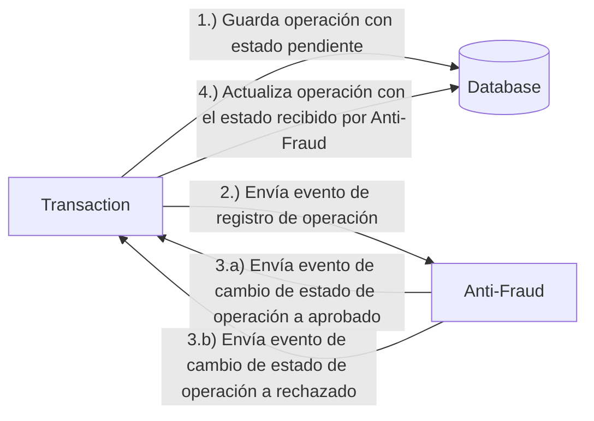

# Reto de Programación en Java con Spring 🚀

Este reto técnico nos permitirá conocer tus habilidades de desarrollo en Java y Spring Boot.La idea es que te diviertas programando mientras demuestras tu enfoque para resolver problemas, buenas prácticas y diseño de código 😄.

> 📌 La forma correcta de enviar tu solución es mediante un **Pull Request (PR)** a este repositorio.

---

## 🧩 Problema

Cada vez que se crea una transacción financiera, esta debe ser validada por nuestro microservicio de antifraude (**Anti-Fraud**). Luego, el mismo servicio envía un mensaje para actualizar el estado de la transacción.

Por ahora, manejamos únicamente **tres estados**:

1. **Pendiente**
2. **Aprobado**
3. **Rechazado**

📌 *Regla de negocio*: Toda transacción con un valor **mayor a 1000** debe ser automáticamente **rechazada**.

### Flujo general:



## 🛠️ Stack Tecnológico

Este reto debe ser resuelto utilizando las siguientes tecnologías:

- Java + Spring Boot
- PostgreSQL como base de datos
- Apache Kafka como sistema de mensajería

> 🐳 Se incluye un `docker-compose.yml` para que puedas configurar tu entorno de desarrollo fácilmente.

---

## Prerequisitos

Por la versión del Spring boot y las tecnologías requeridas necesitamos:

* Java 17 o superior
* Docker y plugin Docker-compose

## Instrucciones de Instalacion

Para instalar esta solución primero hay que compilar los microservicios antifraud y transaction

De ser necesario, hay que descomentar (quitar los REM)y modificar las dos primeras lineas de compile.bat en caso en la variable PATH no se apunta a una versión de JAVA 17 o superior:

```
@REM set JAVA_HOME=C:\Program Files\Java\jdk-17.0.3.1
@REM set PATH=%JAVA_HOME%\bin;%PATH%


call antifraud\gradlew -p antifraud clean -x test build
call transaction\gradlew -p transaction clean -x test build

```

Para ello debemos ejecutar el script:

`compile.bat`

Una vez compilados los microservicios, podemos levantarlos ejecutando los compandos de docker-compose:

`docker-compose up`

Y para detenerlos podemos utilizar:

`docker-compose down`

## 🎯 Endpoints esperados

Deberías implementar dos recursos a nivel de API:

### 1. Crear operación

**POST /transactions**

Request:

```json
{
  "accountExternalIdDebit": "GUID",
  "accountExternalIdCredit": "GUID",
  "tranferTypeId": 1,
  "value": 120
}
```

Response:

```json
{
  "transactionExternalId": "GUID",
}
```

### 2. Consultar operación

**GET /transactions/{transactionExternalId}**

```json
{
  "transactionExternalId": "GUID",
  "transactionType": {
    "name": "Transfer"
  },
  "transactionStatus": {
    "name": "Approved"
  },
  "value": 120,
  "createdAt": "2024-03-24T10:20:30Z"
}
```

## 🚀 Escenario opcional (Bonus)

Puedes elegir cualquier enfoque para almacenar las transacciones. Sin embargo, ten en cuenta que podríamos enfrentar escenarios con **alto volumen de operaciones**, tanto en lectura como en escritura simultánea.

**Pregunta opcional:** ¿Cómo abordarías este requisito de escalabilidad y concurrencia?

**Respuesta:**

Para abordar un alto volumen transaccional se puede optar por:

A nivel de Base de datos:

* Indexar campos de consulta recurrente (transactionalId en este caso)

A nivel de Conexión a Base de datos:

* Configurar un pool de conexiones a Base datos para que los hilos que trabajen de forma concurrente no esperen a que se libere una unica conexión.
* Optimizar sentencias SQL para realizar las consultas o modificaciones más rápido.

A nivel de instancias:

* Aumentar la cantidad de instancias de los servicios y utilizar un balanceador de carga.

---

## 📬 Envío de tu solución

1. Haz un **fork** de este repositorio.
2. Realiza tu implementación en tu fork.
3. Abre una **Pull Request (PR)** a este repositorio con tu solución.

No hay limitaciones estrictas en cuanto a la arquitectura o estilo de código. Siéntete libre de aplicar el paradigma, patrones y modularización que consideres más adecuados para resolver el problema.

---

¿Tienes dudas?
No dudes en contactarnos. ¡Mucho éxito y a divertirse programando! 💪😎
